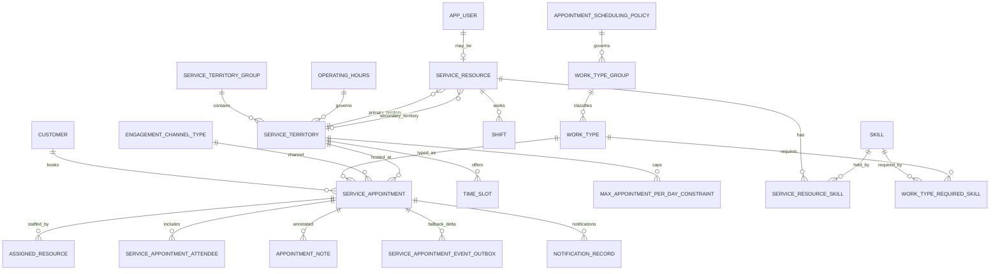

# Schema Design - Locked Model Baseline (WEDAS-1085)

> Story: WEDAS-1025 - DR Database Selection and Data Model Strategy 
> Subtask: WEDAS-1085 - Schema Design and SQL 
> Date: 2026-07-23 | Revised: 2026-07-28 (simplified STM → 2 FKs on service_resource; work_type_group direct FK on work_type; work_type_group_member dropped) 
> Revised: 2026-07-30 (added appointment_scheduling_policy gate; skill / service_resource_skill / work_type_required_skill; max_appointment_per_day_constraint; work_type.buffer_minutes + assigned_resource.block_end_time)

---

## 1. Purpose

Define the target DR schema model based on locked decisions. This supersedes prior assumptions that included Account/Lead polymorphic parenting in DR.

---

## 2. Core Modeling Rules

1. Every record uses dual identity: internal UUID primary key and Salesforce sf_id.
2. Customer is request-fed and flat; no Account or Lead tables in DR core model.
3. Parent polymorphism is removed from DR.
4. Customer to appointment is one-to-many by customerId/MID.
5. User and advisor are separate entities; advisor references user.
6. Volatile profile metadata is not stored in DR.
7. Failback is delta-based batch upsert, with sf_id write-back.
8. Appointment duration is resolved from work_type.
9. **Skills are modeled but gated off for Wealth.** Wealth 1:1 is skill-agnostic *at runtime* — its scheduling policy has `enforce_skills = FALSE`, so Phase 1 never touches the skill tables. WEPA (Phase 2) flips the same policy flag on. The tables exist now so nothing has to be retrofitted.
10. Service territory grouping is required for rule application — work_type_group is Phase 1.
11. Model is shared for Wealth and WPA.
12. **service_territory_member replaced by two FK columns on service_resource** (primary_territory_id, secondary_territory_id). An advisor covers at most 2 branches. Add service_territory_member in Phase 2 if effective-date history is needed.
13. **work_type_group_member dropped** — work_type carries a direct FK to work_type_group (one-to-many). A work type belongs to exactly one business line.
14. **Scheduling rules are policy-driven.** `appointment_scheduling_policy` is the per-business-line gate that toggles skill enforcement, daily-limit enforcement, and overlap override. It is linked from `work_type_group` (Wealth policy vs WEPA policy). No behavior is hard-coded per flow.
15. **Daily caps are territory-scoped config, enforced app-side.** `max_appointment_per_day_constraint` is tied to `service_territory` ("all advisors in this branch: N/day"). It is *not* a storage-layer constraint — Get-Availability and Create count the advisor's non-canceled appointments for that day against the cap. Phase 1 need for Wealth.
16. **Appointments carry a buffer.** `work_type.buffer_minutes` (0/15/30/45/60) extends the advisor's reserved block beyond the meeting. `assigned_resource.block_end_time = sched_end_time + buffer` is stored, and the overlap constraint uses the *block* range, so buffers are respected in double-booking prevention. `sched_end_time` stays the true customer-facing meeting end.
17. **Skill matching is two-sided and date-effective.** `service_resource_skill` (who has a skill, with effective dates) plus `work_type_required_skill` (static required skills). WEPA per-event `requiredSkills` (MCC-ID, language, delivery-channel, VLE, client-segment) are supplied at query time and matched against `service_resource_skill` — advisor must hold all required skills within their effective window.

---

## 3. Canonical Entity Set (Phase 1)

| Domain | Table | Purpose |
|---|---|---|
| Identity | customer | Request-fed customer identity (MID/member/customerId and contact fields) |
| Identity | app_user | Minimal app user profile used by scheduler app |
| Identity | service_resource | Advisor — linked to app_user; carries **primary_territory_id** and **secondary_territory_id** directly (replaces service_territory_member for Phase 1) |
| Territory | service_territory_group | Business-line grouping (Wealth / WPA / Finance); owns time zone, caps, override rules |
| Territory | service_territory | Branch/territory node, linked to territory group |
| Territory | operating_hours | Operating hours master records |
| Territory | time_slot | Slot definitions for branch/group scheduling windows |
| Territory | max_appointment_per_day_constraint | Territory-scoped daily cap ("all advisors in this branch: N/day"); config read at availability/booking, enforced app-side (Phase 1, Wealth) |
| Config | work_type_group | Business-line container (Wealth / WPA / Finance); carries **scheduling_policy_id** FK; 1→many work_type |
| Config | appointment_scheduling_policy | Per-business-line gate: toggles enforce_skills / enforce_daily_limit / allow_overlap_override |
| Config | work_type | Appointment type and duration; carries **work_type_group_id** FK (replaces work_type_group_member) and **buffer_minutes** (0/15/30/45/60) |
| Config | work_type_required_skill | Static required-skill mapping for a work_type (Phase 2 / WEPA; dynamic per-event skills matched at query time) |
| Config | skill | Skill master (MasterLabel + category: language / delivery-channel / MCC / client-segment / VLE) |
| Config | engagement_channel_type | In-person, phone, virtual, etc |
| Resource | shift | Advisor shifts used by availability |
| Resource | service_resource_skill | Advisor ⇄ skill, **date-effective** (effective_start/end_date); read only when policy.enforce_skills = TRUE (Phase 2 / WEPA) |
| Transaction | service_appointment | Appointment header and lifecycle fields |
| Transaction | assigned_resource | One or more advisors assigned to an appointment; carries **allow_overlap** flag for WEPA override (default FALSE) and **block_end_time** (= sched_end_time + work_type buffer) used by the overlap constraint |
| Transaction | service_appointment_attendee | Additional attendees |
| Transaction | appointment_note | Optional notes |
| Integration | service_appointment_event_outbox | Outbox records for DR-created deltas and publish state |
| Integration | notification_record | Notification send tracking |
| Operations | scheduler_log | Operational logs for DR mode |
| Operations | appointment_action_failure | Retry/audit for failed actions |

**Dropped from Phase 1 (vs prior model):**
- `service_territory_member` → replaced by two FK columns on `service_resource`. Add back in Phase 2 if assignment history / effective dates are needed.
- `work_type_group_member` → dropped entirely. Direct FK on `work_type.work_type_group_id` is sufficient (one work type, one business line).

---

## 4. Relationship Diagram

---

## 5. Keys and Constraints

### 5.1 Dual identity pattern

- id UUID primary key
- sf_id CHAR(18) unique nullable

### 5.2 Deterministic customer matching

- customer.customer_id unique not null
- Optional alternate key on customer.mid when distinct from customer_id

### 5.3 Double-booking prevention (buffer-aware)

Use an exclusion constraint on the advisor-time overlap path. It runs over the **block** range (meeting + buffer), not the raw meeting range:

- assigned_resource.service_resource_id with equality
- tstzrange(assigned_resource.sched_start_time, assigned_resource.block_end_time) with overlap operator
- filter out canceled statuses and rows where allow_overlap = TRUE

`block_end_time` is stored on assigned_resource at booking time as `sched_end_time + work_type.buffer_minutes`. It is a real column (not `sched_end_time + interval` inline) because `timestamptz + interval` is only STABLE in PostgreSQL and cannot appear in a GiST/EXCLUDE expression. `sched_end_time` remains the true customer-facing meeting end; `block_end_time` is what the advisor's calendar reserves. When buffer is 0, `block_end_time = sched_end_time` and behavior is unchanged.

### 5.4 Referential integrity

- service_resource.user_id references app_user.id
- service_resource.primary_territory_id references service_territory.id (not null)
- service_resource.secondary_territory_id references service_territory.id (nullable)
- service_appointment.customer_ref_id references customer.id
- service_appointment.work_type_id references work_type.id
- service_appointment.service_territory_id references service_territory.id
- work_type.work_type_group_id references work_type_group.id
- work_type_group.scheduling_policy_id references appointment_scheduling_policy.id
- max_appointment_per_day_constraint.service_territory_id references service_territory.id
- service_resource_skill.service_resource_id references service_resource.id
- service_resource_skill.skill_id references skill.id
- work_type_required_skill.work_type_id references work_type.id
- work_type_required_skill.skill_id references skill.id

---

## 6. API-to-Table Mapping

| Operation | Write Tables | Read Tables |
|---|---|---|
| Create Appointment | service_appointment, assigned_resource (incl. block_end_time), service_appointment_attendee, appointment_note, notification_record, service_appointment_event_outbox | customer, service_resource, shift, work_type (buffer_minutes), service_territory, time_slot, work_type_group, appointment_scheduling_policy, max_appointment_per_day_constraint |
| Get Appointment | none | service_appointment plus joins to customer/resource/territory/work_type/channel/attendee/note |
| Search Appointments | none | service_appointment plus indexed joins |
| Cancel Appointment | service_appointment, notification_record, service_appointment_event_outbox | service_appointment |
| Reschedule Appointment | service_appointment, appointment_note, notification_record, service_appointment_event_outbox | service_appointment, assigned_resource |
| Get Availability | none | shift, service_resource (primary/secondary_territory_id), service_appointment, assigned_resource, operating_hours, time_slot, work_type (buffer_minutes), work_type_group, appointment_scheduling_policy, max_appointment_per_day_constraint, and — only when policy.enforce_skills = TRUE — service_resource_skill + work_type_required_skill |

---

## 7. Failback Pattern

1. Select DR-created deltas where service_appointment.sf_id is null.
2. Transform records for Salesforce upsert payloads.
3. Resolve Account/Lead in Salesforce from customerId/MID at failback time.
4. Upsert in bulk API.
5. Persist returned Salesforce IDs back to DR sf_id.
6. Mark outbox rows published and reconciled.

---

## 8. Implementation Note

The current SQL draft file may still include legacy tables and relationships from earlier iterations. Use this document plus the table catalog in 10-tables-readme-and-erd.md as the target for migration clean-up.

---

## 9. Sign-Off

| Role | Name | Date | Approved |
|---|---|---|---|
| Tech Lead | | | |
| DBA | | | |
| Peer Reviewer | | | |
