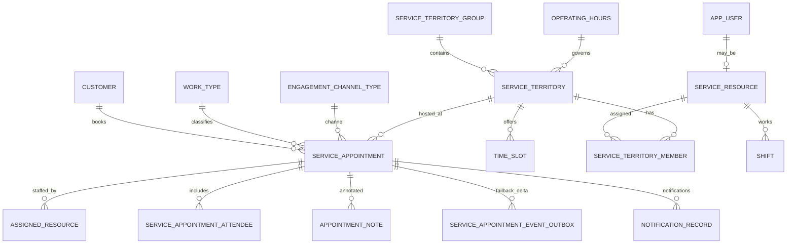

# Schema Design - Locked Model Baseline (WEDAS-1085)

> Story: WEDAS-1025 - DR Database Selection and Data Model Strategy  
> Subtask: WEDAS-1085 - Schema Design and SQL  
> Date: 2026-07-23  
> Authors: team

---

## 1. Purpose

Define the target DR schema model based on locked decisions. This supersedes prior assumptions that included Account/Lead polymorphic parenting in DR.

---

## 2. Core Modeling Rules

1. Every record uses dual identity: internal UUID primary key and Salesforce sf_id.
2. Customer is request-fed and flat; no Account or Lead tables in DR core model.
3. Parent polymorphism is removed from DR.
4. Customer to appointment is one-to-many by customerId/MID.
5. User and advisor are separate entities; advisor references user.
6. Volatile profile metadata is not stored in DR.
7. Failback is delta-based batch upsert, with sf_id write-back.
8. Appointment duration is resolved from work_type.
9. Skills are out of scope for Wealth in this phase.
10. Service territory grouping is required for rule application.
11. Model is shared for Wealth and WPA.

---

## 3. Canonical Entity Set (Phase 1)

| Domain | Table | Purpose |
|---|---|---|
| Identity | customer | Request-fed customer identity (MID/member/customerId and contact fields) |
| Identity | app_user | Minimal app user profile used by scheduler app |
| Identity | service_resource | Advisor-specific attributes linked to app_user |
| Territory | service_territory_group | Parent grouping for rule scope (hours, caps, time zone) |
| Territory | service_territory | Branch/territory node, linked to territory group |
| Territory | operating_hours | Operating hours master records |
| Territory | time_slot | Slot definitions for branch/group scheduling windows |
| Config | work_type | Appointment type and default duration |
| Config | engagement_channel_type | In-person, phone, virtual, etc |
| Resource | service_territory_member | Advisor to territory assignment |
| Resource | shift | Advisor shifts used by availability |
| Transaction | service_appointment | Appointment header and lifecycle fields |
| Transaction | assigned_resource | One or more advisors assigned to an appointment |
| Transaction | service_appointment_attendee | Additional attendees |
| Transaction | appointment_note | Optional notes |
| Integration | service_appointment_event_outbox | Outbox records for DR-created deltas and publish state |
| Integration | notification_record | Notification send tracking |
| Operations | scheduler_log | Operational logs for DR mode |
| Operations | appointment_action_failure | Retry/audit for failed actions |

---

## 4. Relationship Diagram

---

## 5. Keys and Constraints

### 5.1 Dual identity pattern

- id UUID primary key
- sf_id CHAR(18) unique nullable

### 5.2 Deterministic customer matching

- customer.customer_id unique not null
- Optional alternate key on customer.mid when distinct from customer_id

### 5.3 Double-booking prevention

Use exclusion constraint on advisor-time overlap path:

- assigned_resource.service_resource_id with equality
- tstzrange(service_appointment.sched_start_time, service_appointment.sched_end_time) with overlap operator
- filter out canceled statuses

### 5.4 Referential integrity

- service_resource.user_id references app_user.id
- service_appointment.customer_id references customer.id
- service_appointment.work_type_id references work_type.id
- service_appointment.service_territory_id references service_territory.id

---

## 6. API-to-Table Mapping

| Operation | Write Tables | Read Tables |
|---|---|---|
| Create Appointment | service_appointment, assigned_resource, service_appointment_attendee, appointment_note, notification_record, service_appointment_event_outbox | customer, service_resource, shift, service_territory_member, work_type, service_territory, time_slot |
| Get Appointment | none | service_appointment plus joins to customer/resource/territory/work_type/channel/attendee/note |
| Search Appointments | none | service_appointment plus indexed joins |
| Cancel Appointment | service_appointment, notification_record, service_appointment_event_outbox | service_appointment |
| Reschedule Appointment | service_appointment, appointment_note, notification_record, service_appointment_event_outbox | service_appointment, assigned_resource |
| Get Availability | none | shift, service_territory_member, service_appointment, assigned_resource, operating_hours, time_slot, work_type |

---

## 7. Failback Pattern

1. Select DR-created deltas where service_appointment.sf_id is null.
2. Transform records for Salesforce upsert payloads.
3. Resolve Account/Lead in Salesforce from customerId/MID at failback time.
4. Upsert in bulk API.
5. Persist returned Salesforce IDs back to DR sf_id.
6. Mark outbox rows published and reconciled.

---

## 8. Implementation Note

The current SQL draft file may still include legacy tables and relationships from earlier iterations. Use this document plus the table catalog in 10-tables-readme-and-erd.md as the target for migration clean-up.

---

## 9. Sign-Off

| Role | Name | Date | Approved |
|---|---|---|---|
| Tech Lead | | |  |
| DBA | | |  |
| Peer Reviewer | | |  |
