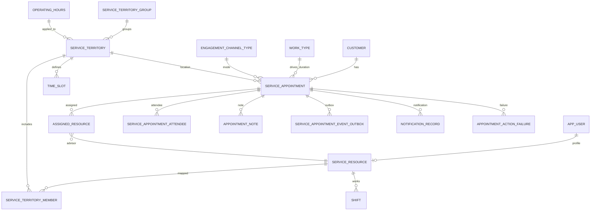
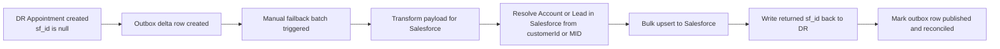

# Tables README and ER Diagrams

> Date: 2026-07-23

---

## 1. Scope

This is the table-level README for the locked DR model. It is the implementation reference for Wealth and WPA shared Scheduler APIs.

---

## 2. Shared Conventions

- Every table has id UUID primary key.
- Most integration-facing entities include sf_id CHAR(18) unique nullable.
- created_at and updated_at audit columns are required.
- Soft delete is preferred for master entities using is_active where needed.

---

## 3. Table Catalog

| Table | Purpose | Key Columns | Relationships |
|---|---|---|---|
| customer | Request-fed customer identity | id, sf_id, customer_id (business key: MID or member ID), customer_type, first_name, last_name, email, phone | 1 to many with service_appointment (joined via service_appointment.customer_ref_id) |
| app_user | Minimal user profile for anyone using app | id, sf_id, corp_id, first_name, last_name, email | 1 to 0 or 1 with service_resource |
| service_resource | Advisor subset data | id, sf_id, user_id, advisor_code, is_active | many to 1 with app_user |
| service_territory_group | Group-level policy container | id, sf_id, name, time_zone, wpa_cap_enabled | 1 to many with service_territory |
| service_territory | Branch or territory unit | id, sf_id, territory_group_id, branch_number, name, operating_hours_id | many to 1 with service_territory_group |
| operating_hours | Operating-hours master | id, sf_id, name, timezone | 1 to many with service_territory |
| time_slot | Slot definitions for branch or group | id, sf_id, territory_id, day_of_week, start_time, end_time, slot_minutes | many to 1 with service_territory |
| work_type | Appointment type and duration | id, sf_id, name, duration_minutes, is_active | 1 to many with service_appointment |
| engagement_channel_type | Meeting method channels | id, sf_id, name, is_active | 1 to many with service_appointment |
| service_territory_member | Advisor-territory mapping | id, sf_id, service_resource_id, service_territory_id, effective_start, effective_end | many to 1 with service_resource and service_territory |
| shift | Advisor shifts for availability | id, sf_id, service_resource_id, start_time, end_time, status | many to 1 with service_resource |
| service_appointment | Appointment header | id, sf_id, customer_ref_id (FK to customer.id), work_type_id, engagement_channel_type_id, service_territory_id, status, sched_start_time, sched_end_time, created_in_dr | many to 1 with customer/work_type/channel/territory |
| assigned_resource | Advisors assigned to an appointment | id, sf_id, service_appointment_id, service_resource_id, is_primary | many to 1 with service_appointment and service_resource |
| service_appointment_attendee | Additional attendees | id, sf_id, service_appointment_id, attendee_email, attendee_name, relationship | many to 1 with service_appointment |
| appointment_note | Appointment notes | id, sf_id, service_appointment_id, note_type, note_text, submitted_by_corp_id | many to 1 with service_appointment |
| service_appointment_event_outbox | Failback and outbound event delta | id, service_appointment_id, event_type, published, published_at, failback_status | many to 1 with service_appointment |
| notification_record | Notification audit | id, service_appointment_id, notification_type, channel, status, sent_at | many to 1 with service_appointment |
| scheduler_log | Operational log trail | id, level, source, message, context_json, created_at | standalone |
| appointment_action_failure | Failed action retry tracking | id, service_appointment_id, action_type, reason, retry_count, last_retry_at, status | many to 1 with service_appointment |

---

## 4. Core ER Diagram

---

## 5. Failback Flow Diagram

---

## 6. Required Indexes (Minimum)

| Table | Index |
|---|---|
| service_appointment | status, sched_start_time |
| service_appointment | customer_id, sched_start_time |
| assigned_resource | service_resource_id, service_appointment_id |
| service_territory_member | service_resource_id, service_territory_id |
| shift | service_resource_id, start_time, end_time |
| service_appointment_event_outbox | published, created_at |
| customer | customer_id unique |
| app_user | corp_id unique |

---

## 7. Integrity Rules

1. No overlap booking for same advisor and active statuses.
2. service_appointment.sched_end_time must be greater than sched_start_time.
3. assigned_resource must reference an active advisor.
4. work_type.duration_minutes must be positive.
5. service_territory must belong to exactly one territory group.
