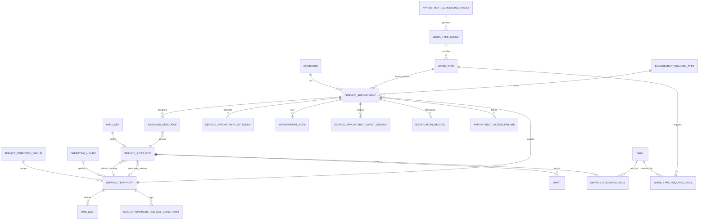
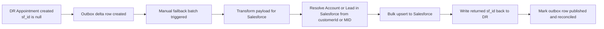

# Tables README and ER Diagrams

> Date: 2026-07-23

---

## 1. Scope

This is the table-level README for the locked DR model. It is the implementation reference for Wealth and WPA shared Scheduler APIs.

---

## 2. Shared Conventions

- Every table has id UUID primary key.
- Most integration-facing entities include sf_id CHAR(18) unique nullable.
- created_at and updated_at audit columns are required.
- Soft delete is preferred for master entities using is_active where needed.

---

## 3. Table Catalog

| Table | Purpose | Key Columns | Relationships |
|---|---|---|---|
| customer | Request-fed customer identity | id, sf_id, customer_id (MID/member ID), customer_type, first_name, last_name, email, phone | 1 to many with service_appointment |
| app_user | Minimal user profile for anyone using app | id, sf_id, corp_id, first_name, last_name, email | 1 to 0 or 1 with service_resource |
| service_resource | Advisor subset data | id, sf_id, user_id, advisor_code, is_active, **primary_territory_id**, **secondary_territory_id** | many to 1 with app_user; primary_territory_id NOT NULL; secondary_territory_id nullable |
| work_type_group | Business-line container (Wealth / WPA / Finance) | id, sf_id, name, time_zone, allow_override, **scheduling_policy_id**, is_active | many to 1 with appointment_scheduling_policy; 1 to many with work_type |
| appointment_scheduling_policy | Per-business-line scheduling gate | id, sf_id, name, **enforce_skills**, **enforce_daily_limit**, **allow_overlap_override**, is_active | 1 to many with work_type_group |
| work_type | Appointment type, duration, and buffer | id, sf_id, name, duration_minutes, **buffer_minutes** (0/15/30/45/60, default 0), **work_type_group_id**, is_active | many to 1 with work_type_group; 1 to many with service_appointment; 1 to many with work_type_required_skill |
| skill | Skill master | id, sf_id, name (MasterLabel), skill_category (language/delivery-channel/MCC/client-segment/VLE), is_active | 1 to many with service_resource_skill and work_type_required_skill |
| service_resource_skill | Advisor ⇄ skill, date-effective | id, sf_id, service_resource_id, skill_id, effective_start_date, effective_end_date (nullable), skill_level (nullable) | many to 1 with service_resource and skill |
| work_type_required_skill | Static required-skill mapping for a work type | id, sf_id, work_type_id, skill_id | many to 1 with work_type and skill |
| max_appointment_per_day_constraint | Territory-scoped daily cap | id, sf_id, name, **service_territory_id**, max_appointments_per_day, work_type_group_id (nullable), effective_start_date, effective_end_date (nullable), is_active | many to 1 with service_territory |
| service_territory_group | Group-level policy container | id, sf_id, name, time_zone, wpa_cap_enabled | 1 to many with service_territory |
| service_territory | Branch or territory unit | id, sf_id, territory_group_id, branch_number, name, operating_hours_id | many to 1 with service_territory_group |
| operating_hours | Operating-hours master | id, sf_id, name, timezone | 1 to many with service_territory |
| time_slot | Slot definitions for branch or group | id, sf_id, territory_id, day_of_week, start_time, end_time, slot_minutes | many to 1 with service_territory |
| engagement_channel_type | Meeting method channels | id, sf_id, name, is_active | 1 to many with service_appointment |
| shift | Advisor shifts for availability | id, sf_id, service_resource_id, start_time, end_time, status | many to 1 with service_resource |
| service_appointment | Appointment header | id, sf_id, customer_ref_id, work_type_id, engagement_channel_type_id, service_territory_id, status, sched_start_time, sched_end_time, created_in_dr | many to 1 with customer/work_type/channel/territory |
| assigned_resource | Advisors assigned to an appointment | id, sf_id, service_appointment_id, service_resource_id, is_primary, sched_start_time, sched_end_time, **block_end_time** (= sched_end_time + buffer), **allow_overlap** (default FALSE), status | many to 1 with service_appointment and service_resource |
| service_appointment_attendee | Additional attendees | id, sf_id, service_appointment_id, attendee_email, attendee_name, relationship | many to 1 with service_appointment |
| appointment_note | Appointment notes | id, sf_id, service_appointment_id, note_type, note_text, submitted_by_corp_id | many to 1 with service_appointment |
| service_appointment_event_outbox | Failback and outbound event delta | id, service_appointment_id, event_type, published, published_at, failback_status | many to 1 with service_appointment |
| notification_record | Notification audit | id, service_appointment_id, notification_type, channel, status, sent_at | many to 1 with service_appointment |
| scheduler_log | Operational log trail | id, level, source, message, context_json, created_at | standalone |
| appointment_action_failure | Failed action retry tracking | id, service_appointment_id, action_type, reason, retry_count, last_retry_at, status | many to 1 with service_appointment |

**Dropped from Phase 1:**

- `service_territory_member` — replaced by `primary_territory_id` / `secondary_territory_id` on `service_resource`. Advisors cover at most 2 branches. Re-add in Phase 2 if assignment history or effective dates are needed.
- `work_type_group_member` — dropped entirely. `work_type.work_type_group_id` FK is sufficient (one work type belongs to exactly one business line).

---

## 4. Core ER Diagram

---

## 5. Failback Flow Diagram

---

## 6. Required Indexes (Minimum)

| Table | Index |
|---|---|
| service_appointment | status, sched_start_time |
| service_appointment | customer_ref_id, sched_start_time |
| assigned_resource | service_resource_id, service_appointment_id |
| service_resource | primary_territory_id |
| service_resource | secondary_territory_id |
| shift | service_resource_id, start_time, end_time |
| work_type | work_type_group_id |
| service_resource_skill | service_resource_id, skill_id, effective_start_date |
| service_resource_skill | skill_id (for requirement-side lookups) |
| work_type_required_skill | work_type_id, skill_id |
| max_appointment_per_day_constraint | service_territory_id, is_active |
| service_appointment | service_territory_id, sched_start_time (daily-cap counting) |
| service_appointment_event_outbox | published, created_at |
| customer | customer_id unique |
| app_user | corp_id unique |

---

## 7. Integrity Rules

1. No overlap booking for same advisor and active statuses — EXCLUDE constraint on assigned_resource over `tstzrange(sched_start_time, block_end_time)` (the buffer-inclusive block range), skipping canceled rows and rows where allow_overlap = TRUE.
2. service_appointment.sched_end_time must be greater than sched_start_time; assigned_resource.block_end_time must be greater than or equal to sched_end_time.
3. assigned_resource must reference an active advisor.
4. work_type.duration_minutes must be positive; work_type.buffer_minutes must be one of 0, 15, 30, 45, 60.
5. service_territory must belong to exactly one territory group.
6. service_resource.primary_territory_id must not be null — every advisor must have a primary branch.
7. work_type must belong to exactly one work_type_group — a work type belongs to one business line only.
8. work_type_group.scheduling_policy_id must reference an active appointment_scheduling_policy.
9. Skills are consulted at runtime only when the governing policy has enforce_skills = TRUE (Phase 2 / WEPA). Wealth 1:1 policy has enforce_skills = FALSE, so Phase 1 never joins the skill tables.
10. A WEPA required skill is satisfied only if the advisor holds it within the effective window (service_resource_skill.effective_start_date ≤ appointment date, and effective_end_date is null or ≥ appointment date).
11. max_appointment_per_day_constraint is territory-scoped config; the daily cap is enforced app-side by counting an advisor's non-canceled appointments for that date against max_appointments_per_day (not a storage-layer constraint).
