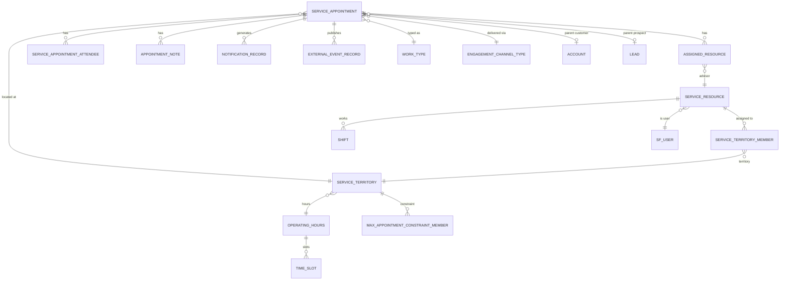

# Schema Design & SQL Files — WEDAS-1085

> **Story**: WEDAS-1025 — DR Database Selection and Data Model Strategy  
> **Subtask**: WEDAS-1085 — Schema Design and SQL Files  
> **Date**: 2026-07-16  
> **Authors**: Naveen Chelluboina, team

---

## 1. Overview

This document describes the schema design delivered in `aurora_scheduler_schema.sql` and maps each table to its Salesforce source object, the API operations that use it, and the sync strategy.

---

## 2. Schema File Location

```
ap164262-dap-coreapi/
├── docs/
│   └── dr-database-strategy/
│       ├── 01-dr-data-scope.md
│       ├── 02-option-a-single-rdbms.md
│       ├── 03-option-b-hybrid.md
│       ├── 04-comparison-matrix-recommendation.md
│       ├── 05-retention-performance-requirements.md
│       ├── 06-schema-design.md              ← this file
│       └── sql/
│           ├── V1__create_extensions_enums.sql
│           ├── V2__create_config_tables.sql
│           ├── V3__create_resource_tables.sql
│           ├── V4__create_appointment_tables.sql
│           ├── V5__create_event_workshop_tables.sql
│           ├── V6__create_integration_tables.sql
│           ├── V7__create_constraint_tables.sql
│           ├── V8__create_audit_tables.sql
│           ├── V9__create_indexes.sql
│           ├── V10__create_triggers.sql
│           └── V11__create_views.sql
```

> **Note**: The complete schema is also available as a single file: `aurora_scheduler_schema.sql` (attached to WEDAS-1025). The Flyway-split versions below are recommended for production deployment.

---

## 3. Entity-Relationship Diagram (Key Tables)



---

## 4. Table-to-API Operation Mapping

### 4.1 Create Appointment (POST)

| Table | Operation | Fields Written |
|-------|-----------|---------------|
| `service_appointment` | INSERT | All core fields: status, times, customer, territory, channel, worktype, notes |
| `assigned_resource` | INSERT (1-2 rows) | service_appointment_id, service_resource_id, is_primary_resource |
| `service_appointment_attendee` | INSERT (0-N rows) | attendee info, email, relationship |
| `appointment_note` | INSERT (0-2 rows) | Pre-meeting customer and/or rep notes |
| `notification_record` | INSERT | Confirmation notification tracking |
| `service_appointment_event_outbox` | INSERT | DEP event for downstream consumers |

**Read dependencies** (for validation):
- `service_resource` + `shift` + `service_territory_member` → advisor availability
- `max_appointment_per_day_constraint` → appointment limits
- `service_appointment` (existing) → conflict detection

### 4.2 Get Appointment by ID (GET /{id})

| Table | Operation | Key Columns |
|-------|-----------|-------------|
| `service_appointment` | SELECT | All fields |
| `assigned_resource` | SELECT (JOIN) | advisor details |
| `service_resource` → `sf_user` | SELECT (JOIN) | advisor name, corp_id |
| `service_appointment_attendee` | SELECT (JOIN) | attendee list |
| `service_territory` | SELECT (JOIN) | branch info |
| `work_type` | SELECT (JOIN) | work type name/duration |
| `engagement_channel_type` | SELECT (JOIN) | channel name |
| `account` / `lead` | SELECT (JOIN) | customer name |
| `appointment_note` | SELECT (JOIN) | notes |

> **Optimization**: Use `v_appointment_full` view for single-query retrieval.

### 4.3 Search Appointments (GET ?params)

| Filter Parameter | Table | Column | Index |
|-----------------|-------|--------|-------|
| startDate / endDate | `service_appointment` | sched_start_time, sched_end_time | `idx_sa_sched_time` |
| corpIds[] | `assigned_resource` → `service_resource` → `sf_user` | corp_id | `idx_sr_corp_id` |
| branchNumbers[] | `service_territory` | branch_number | `idx_sa_territory` |
| meetingMethod | `engagement_channel_type` | name | `idx_sa_engagement_channel` |
| status != Canceled | `service_appointment` | status | `idx_sa_status` |
| Pagination | `service_appointment` | created_at / sched_start_time | `idx_sa_created_at` |

### 4.4 Cancel Appointment (DELETE /{id})

| Table | Operation | Fields Updated |
|-------|-----------|---------------|
| `service_appointment` | UPDATE | status='Canceled', cancellation_reason, cancellation_time, cancelled_by, cancelled_by_corp_id |
| `notification_record` | INSERT | Cancellation notification tracking |
| `service_appointment_event_outbox` | INSERT | DEP cancel event |

### 4.5 Reschedule Appointment (PUT /{id})

| Table | Operation | Fields |
|-------|-----------|--------|
| `service_appointment` | UPDATE | sched_start_time, sched_end_time, status='Rescheduled', reschedule_comments |
| `appointment_note` | INSERT (optional) | New notes if provided |
| `notification_record` | INSERT | Reschedule notification |
| `service_appointment_event_outbox` | INSERT | DEP reschedule event |

### 4.6 Get Availability

| Table | Operation | Purpose |
|-------|-----------|---------|
| `service_resource` | SELECT | Find advisors |
| `service_territory_member` | SELECT | Advisor ↔ territory mapping |
| `shift` | SELECT | Advisor working hours |
| `service_appointment` + `assigned_resource` | SELECT | Existing bookings (conflict detection) |
| `operating_hours` + `time_slot` | SELECT | Branch configured hours |
| `max_appointment_per_day_constraint` | SELECT | Daily appointment limits |
| `work_type` | SELECT | Duration for slot calculation |

---

## 5. Key Design Patterns

### 5.1 Salesforce ID Mapping

Every table has:
```sql
id      UUID        PRIMARY KEY DEFAULT gen_random_uuid(),  -- Internal PK
sf_id   CHAR(18)    UNIQUE,                                 -- Salesforce 18-char ID
```

- **Sync**: Use `sf_id` for upsert matching during SF→DR sync
- **API**: Use `sf_id` in API responses (consumers expect SF-format IDs)
- **Internal**: Use `id` (UUID) for FK relationships within DR DB

### 5.2 Polymorphic Parent (Account/Lead)

```sql
parent_account_id   UUID    REFERENCES account(id),
parent_lead_id      UUID    REFERENCES lead(id),
parent_record_type  VARCHAR(20),  -- 'Account' or 'Lead'

CONSTRAINT chk_parent_record CHECK (
    (parent_account_id IS NOT NULL AND parent_lead_id IS NULL)
    OR (parent_lead_id IS NOT NULL AND parent_account_id IS NULL)
    OR (parent_account_id IS NULL AND parent_lead_id IS NULL)
)
```

### 5.3 Outbox Pattern (DEP Replacement)

```sql
CREATE TABLE service_appointment_event_outbox (
    id                      UUID PRIMARY KEY,
    service_appointment_id  UUID REFERENCES service_appointment(id),
    sf_appointment_id       VARCHAR(50),
    status                  appointment_status,
    sched_start_time        TIMESTAMPTZ,
    sched_end_time          TIMESTAMPTZ,
    published               BOOLEAN NOT NULL DEFAULT FALSE,
    published_at            TIMESTAMPTZ,
    created_at              TIMESTAMPTZ NOT NULL DEFAULT NOW()
);
```

A background worker polls `WHERE published = FALSE` and publishes to SNS/EventBridge.

### 5.4 Conflict Detection Query

```sql
-- Check if advisor has overlapping appointment at requested time
SELECT COUNT(*) FROM service_appointment sa
JOIN assigned_resource ar ON ar.service_appointment_id = sa.id
WHERE ar.service_resource_id = :advisorId
  AND sa.status NOT IN ('Canceled')
  AND sa.sched_start_time < :requestedEnd
  AND sa.sched_end_time > :requestedStart;
-- If count > 0 → return 409 Conflict
```

### 5.5 Availability Computation

```sql
-- Get advisor shifts for date range
SELECT s.start_time, s.end_time
FROM shift s
WHERE s.service_resource_id = :advisorId
  AND s.start_time >= :rangeStart
  AND s.end_time <= :rangeEnd
  AND s.status = 'Published';

-- Subtract existing appointments
SELECT sa.sched_start_time, sa.sched_end_time
FROM service_appointment sa
JOIN assigned_resource ar ON ar.service_appointment_id = sa.id
WHERE ar.service_resource_id = :advisorId
  AND sa.status NOT IN ('Canceled')
  AND sa.sched_start_time >= :rangeStart
  AND sa.sched_end_time <= :rangeEnd;

-- Available slots = shift windows - booked slots - Outlook busy (from Graph API)
```

---

## 6. Flyway Migration Plan

| Version | File | Description |
|---------|------|-------------|
| V1 | `V1__create_extensions_enums.sql` | pgcrypto, postgis, all ENUM types |
| V2 | `V2__create_config_tables.sql` | operating_hours, service_territory, time_slot, engagement_channel_type, work_type, work_type_group, platforms, mappings, scheduler_config, scheduler_global |
| V3 | `V3__create_resource_tables.sql` | sf_user, account, lead, service_resource, skill, service_resource_skill, service_territory_member, shift, resource_alignment |
| V4 | `V4__create_appointment_tables.sql` | event_request, service_appointment, assigned_resource, service_appointment_attendee, appointment_note |
| V5 | `V5__create_event_workshop_tables.sql` | event_audience, event_participant, event_additional_attendee |
| V6 | `V6__create_integration_tables.sql` | notification_record, publishing_event_record, external_event_record, edl_event_record, service_appointment_event_outbox |
| V7 | `V7__create_constraint_tables.sql` | max_appointment_per_day_constraint, max_appointment_constraint_member |
| V8 | `V8__create_audit_tables.sql` | appointment_action_failure, service_territory_member_history, scheduler_log, scheduled_job_run_tracker, participant_bin, crt_settings |
| V9 | `V9__create_indexes.sql` | All 15+ indexes |
| V10 | `V10__create_triggers.sql` | updated_at trigger, participant_count trigger |
| V11 | `V11__create_views.sql` | v_appointment_full, v_advisor_schedule |

---

## 7. Data Load Scripts (Initial)

### 7.1 SF → DR Bulk Load (via SOQL Bulk API)

```bash
# Export from SF (example for service_appointment)
sfdx data:query \
  --query "SELECT Id, Status, SchedStartTime, SchedEndTime, ... FROM ServiceAppointment WHERE Status IN ('Scheduled','Rescheduled') AND SchedStartTime >= TODAY" \
  --result-format csv \
  --target-org prod > appointments.csv

# Load to Aurora (via psql COPY)
psql $DR_DATABASE_URL -c "\COPY service_appointment(...) FROM 'appointments.csv' WITH CSV HEADER"
```

### 7.2 Incremental Sync (DEP Consumer)

```java
// Pseudo-code: DEP event handler
@KafkaListener(topics = "dap-appointment-events")
public void handleAppointmentEvent(AppointmentEvent event) {
    switch (event.getType()) {
        case "Scheduled":
            appointmentRepository.upsertFromDep(event);
            break;
        case "Rescheduled":
            appointmentRepository.updateTimesFromDep(event);
            break;
        case "Canceled":
            appointmentRepository.cancelFromDep(event);
            break;
    }
}
```

---

## 8. Validation Against DR Data Scope

| Data Scope Item (from WEDAS-1080) | Table Exists | Indexed | Sync Strategy Defined |
|-----------------------------------|-------------|---------|----------------------|
| Operating Hours | ✅ | ✅ | Daily batch |
| Time Slots | ✅ | ✅ | Daily batch |
| Service Territories | ✅ | ✅ | Daily batch |
| Work Types | ✅ | ✅ | Daily batch |
| Engagement Channels | ✅ | ✅ | Daily batch |
| Service Resources | ✅ | ✅ | Hourly delta |
| Territory Members | ✅ | ✅ | Hourly delta |
| Shifts | ✅ | ✅ | Hourly delta |
| Service Appointments | ✅ | ✅ | Real-time (DEP) |
| Assigned Resources | ✅ | ✅ | Real-time (DEP) |
| Attendees | ✅ | ✅ | Real-time (DEP) |
| Appointment Notes | ✅ | N/A | Real-time (DEP) |
| Notification Records | ✅ | ✅ | DR-generated |
| DEP Publishing Records | ✅ | N/A | DR-generated |
| Audit Logs | ✅ | ✅ | DR-generated |

**Result**: All data scope items have corresponding schema coverage. ✅

---

## 9. Peer Review Checklist

- [ ] All tables have `id UUID PRIMARY KEY` + `sf_id CHAR(18) UNIQUE`
- [ ] All tables have `created_at` + `updated_at` audit columns
- [ ] Foreign keys reference correct parent tables
- [ ] ENUMs match current SF picklist values
- [ ] Indexes cover known query patterns (from Apex SOQL audit)
- [ ] Outbox table supports DEP publishing replacement
- [ ] Conflict detection query is performant (indexed)
- [ ] Polymorphic parent pattern handles Account + Lead
- [ ] JSONB used for flexible payload columns (notifications, publishing)
- [ ] PostGIS extension available for proximity queries
- [ ] Views match common read patterns from API operations

---

## 10. Sign-Off

| Role | Name | Date | Approved |
|------|------|------|----------|
| Tech Lead | | | ☐ |
| DBA | | | ☐ |
| Peer Reviewer | | | ☐ |
